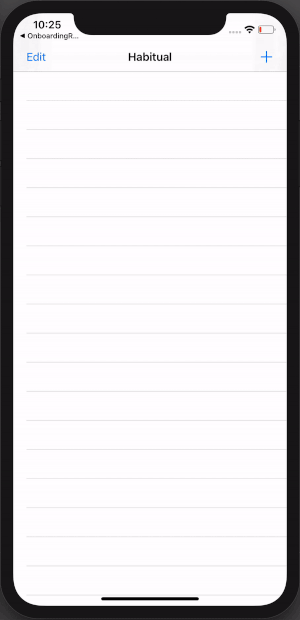

# Habitual Tutorial
Make's School tutorial on an iOS app to track daily habits

## About
The purpose of this tutorial is to learn about AutoLayout and Persistance Storage

### Features
* Add Habits - with icons and title
* Remove Habits - with confirmation
* Single Habit Screen - with persistance data storage

### Basic App Walk-through

### Run Locally

Project code can be viewed locally  and run on Xcode's simulator by cloning or forking this repo.

## Built With
* [Xcode - 11.3.1](https://developer.apple.com/xcode/) - The IDE used
* [Swift - 5.1.4](https://developer.apple.com/swift/) - Programming Language

## Author(s)
* Cao Mai - portfolio can be found at:
https://www.makeschool.com/portfolio/Cao-Mai

## License

This project is licensed under the MIT License - see the [LICENSE.md](LICENSE.md) file for details

